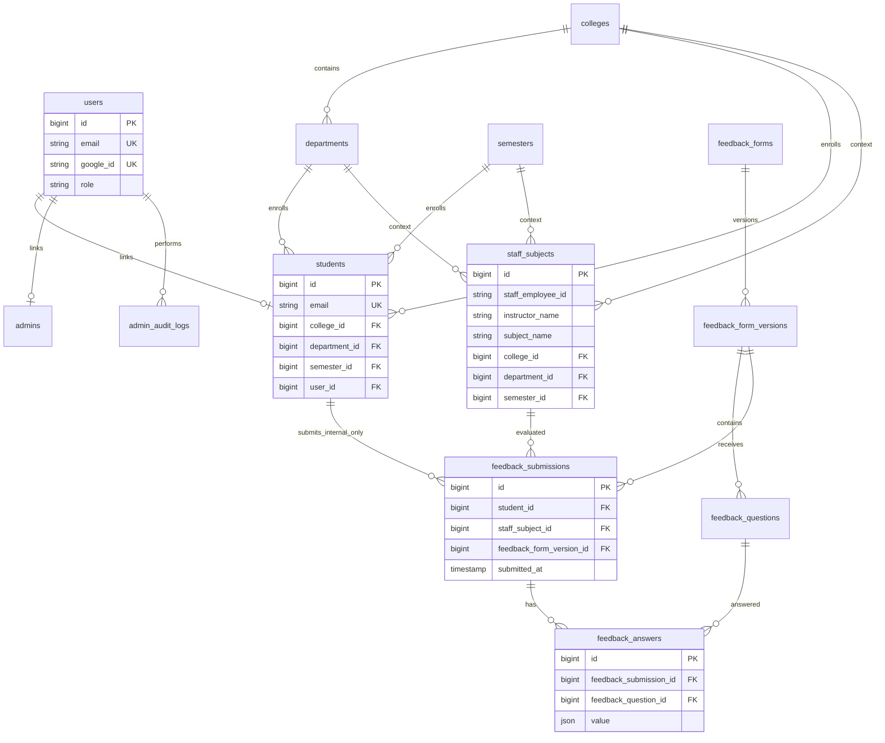

# Database schema (conceptual ERD)

## Notes

- **Who can evaluate whom:** There is no `student_staff` mapping table. A student may submit feedback only for `staff_subjects` rows whose `college_id`, `department_id`, and `semester_id` match the student’s.
- All administrative entities (`colleges`, `departments`, `semesters`, `students`, `admins`, `staff_subjects`, `feedback_forms`, `feedback_form_versions`, `feedback_questions`) use **soft deletes** where applicable.
- **Uniqueness** on feedback is enforced on `(student_id, staff_subject_id, feedback_form_version_id)` so each student evaluates a given instructor-subject at most once per form version.
- **Reports** aggregate `feedback_answers` only; student identifiers are not exposed in export views.
